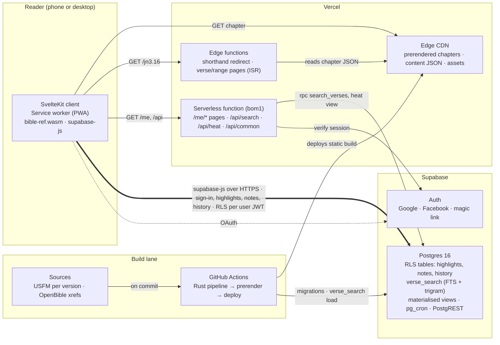
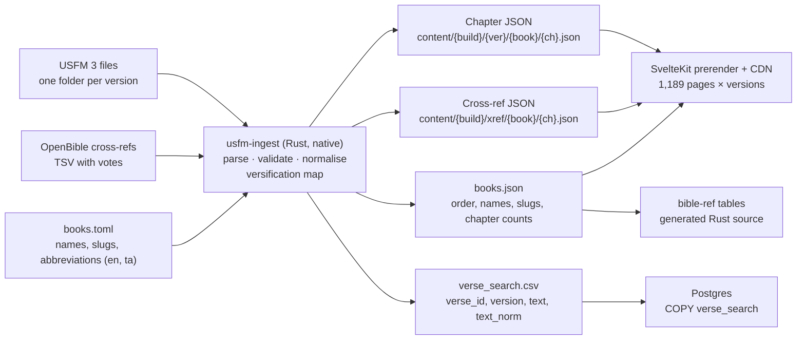
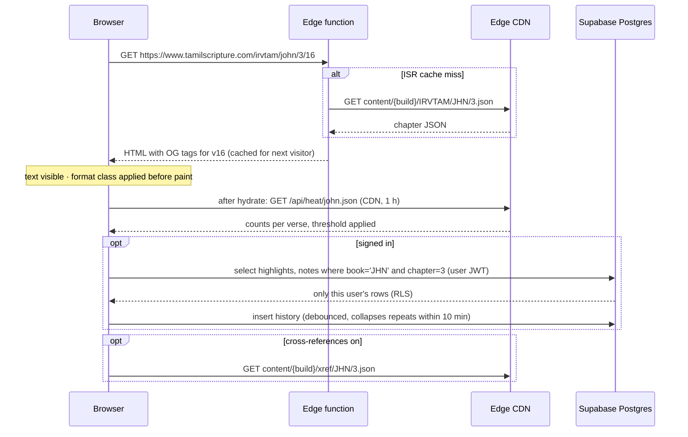
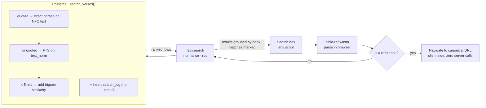
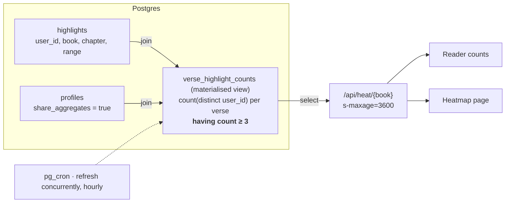
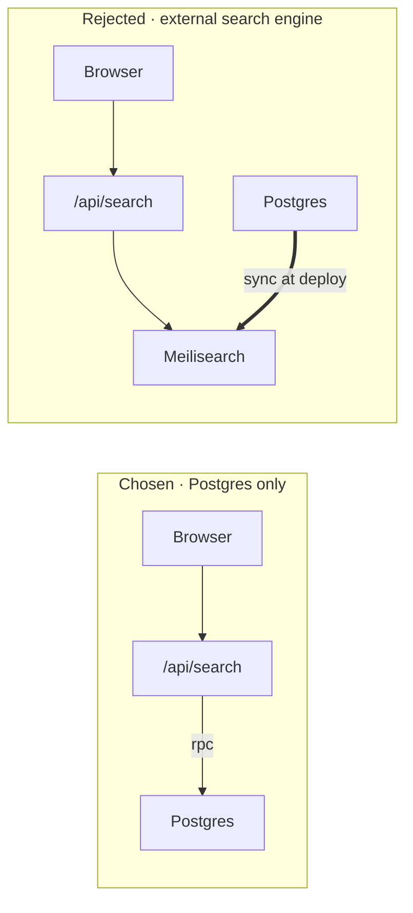

# Tamil Bible Study Web App — Software Architecture Design

**மென்பொருள் கட்டமைப்பு வடிவமைப்பு**

| | |
|---|---|
| Site | https://www.tamilscripture.com |
| Version | 0.1 draft, 6 September 2026 |
| Front end | SvelteKit 2, TypeScript |
| Hosting | Vercel, Mumbai primary |
| Data | Supabase Postgres 16, Auth |
| Compiled core | Rust crates, WebAssembly |

How the Tamil Bible study web app is built: a static, edge-served scripture layer; a Postgres core for search and personal data; and a small Rust workspace that owns the text pipeline and the reference parser shared by browser and server.

Companion document: [requirements.md](requirements.md).

## Contents

1. [Drivers and principles](#1-drivers-and-principles)
2. [System context](#2-system-context)
3. [Content pipeline](#3-content-pipeline)
4. [Web application](#4-web-application)
5. [Opening a verse](#5-opening-a-verse)
6. [Search](#6-search)
7. [Auth and personal data](#7-auth-and-personal-data)
8. [Community aggregates](#8-community-aggregates)
9. [Offline and PWA](#9-offline-and-pwa)
10. [Performance design](#10-performance-design)
11. [Operations](#11-operations)
12. [Decision records](#12-decision-records)
13. [Risks and mitigations](#13-risks-and-mitigations)
14. [Repository layout](#14-repository-layout)

---

## 1. Drivers and principles

The requirements that shape the architecture most: a 500 ms verse open on a 4G phone, one-second search with Tamil fuzzy matching, human-readable URLs, personal data behind sign-in, and community aggregates that must not leak who highlighted what.

- **Scripture is static; people are dynamic.** The Bible text does not change between deploys, so it is built once and served from the CDN as HTML and JSON. Only what a person does (highlights, notes, history, searches) touches a database at request time.
- **Text first, everything else after.** A chapter renders completely from the static payload. Highlights, counts, cross-references and notes stream in afterwards and never block first paint.
- **One parser, everywhere.** Reference parsing and Tamil normalisation live in Rust, compiled to WebAssembly for the browser and to native code for the pipeline, with generated SQL for the database. The same fixtures test all three.
- **Key personal data by verse, not by version.** A highlight on `JHN.3.16` shows in every version and survives adding translations.
- **The database enforces privacy.** Row-level security policies, not application code, decide who reads which row. Aggregates are computed inside Postgres with the threshold applied before anything leaves.
- **Reading never depends on Supabase.** If the database is down, every chapter still loads. Sign-in features degrade with a message.

---

## 2. System context

Three runtime parties and one build lane. The browser talks to Vercel for pages and to Supabase directly for personal data, so a highlight write is one hop, not two.



*Fig 1. Runtime parties and the build lane. The thick path is the only one that carries personal data, and it goes straight from the browser to Postgres.*

| Party | Responsibility | Owns |
|---|---|---|
| Browser / PWA | Render chapters, apply the user's format, parse references locally, read and write personal rows, cache for offline. | Reader settings in local storage, offline queue in IndexedDB |
| Vercel edge CDN | Serve prerendered chapter HTML, content JSON, fonts and app bundles from the nearest edge with immutable caching. | Static build output |
| Vercel edge functions | Resolve shorthand URLs to canonical ones. Render verse and range pages with per-verse Open Graph tags, cached by ISR until the next deploy. | Nothing persistent |
| Vercel serverless (bom1) | Server-render signed-in pages. Proxy search and aggregate reads to Postgres with CDN caching headers. | Nothing persistent |
| Supabase Postgres | Personal tables under RLS, the search table and functions, materialised views, scheduled jobs. | All mutable state |
| Supabase Auth | OAuth with Google and Facebook, magic link, JWT issuance and refresh. | Identities and sessions |
| GitHub Actions | Run the Rust pipeline, tests, prerender, Lighthouse budgets, deploy, apply migrations and load the search table. | Build artifacts |

---

## 3. Content pipeline

USFM goes in, four outputs come out, and each output has exactly one consumer. The pipeline is deterministic: the same inputs always produce byte-identical outputs, which is what makes immutable CDN caching safe.



*Fig 2. Every build output has one consumer. Chapter and cross-reference JSON are served under a content build id, so URLs never change meaning and the CDN can cache them forever.*

### Chapter JSON shape

```json
{
  "version": "IRVTAM", "book": "JHN", "chapter": 3, "build": "c7f3a9",
  "blocks": [
    { "type": "heading", "level": 1, "text": "நிக்கொதேமு இயேசுவைச் சந்தித்தல்" },
    { "type": "para",
      "verses": [
        { "id": "JHN.3.1", "n": 1, "text": "யூதர்களுக்குள்ளே ...", "notes": [] },
        { "id": "JHN.3.2", "n": 2, "text": "...", "notes": [{ "caller": "a", "text": "..." }] }
      ] },
    { "type": "poetry", "level": 1, "verses": [] }
  ],
  "bridges": { "JHN.3.17": "JHN.3.17-18" },
  "prev": { "book": "JHN", "chapter": 2 }, "next": { "book": "JHN", "chapter": 4 }
}
```

- **Verse ids** are `{USFM book code}.{chapter}.{verse}`. They are the join key for highlights, notes, history, cross-references and search results, and they are identical across versions.
- **Blocks, not a flat list.** Paragraph, poetry and heading blocks come straight from USFM so the Reader format can lay text out as the translators intended. Headings are separate blocks, which is what makes the heading toggle a CSS rule rather than a re-render.
- **Bridges** map every verse inside a bridge to the bridged range so `/john/3/17` resolves even when the text has `\v 17-18`.
- **Introductions** are emitted as `{book}/intro.json` and loaded only when the toggle is on and the reader is at chapter 1.

### Rust workspace

| Crate | Builds to | Does | Tests |
|---|---|---|---|
| `usfm-ingest` | Native CLI | USFM 3 parse (own parser over the eBible USFM dialect; see section 14), validation report, chapter and cross-ref JSON, books.json, search CSV, versification map. | Golden-file tests per version; determinism test (two runs, identical bytes). |
| `bible-ref` | WebAssembly (~35 kB gzipped) and native | Reference grammar, book name and abbreviation matching in English and Tamil, Tamil numerals, canonical URL building, bridge resolution. | Fixture list of 500+ inputs shared with the browser and server test suites. |
| `tamil-norm` | WebAssembly, native, and a generated SQL function | NFC, near-letter folding (ன/ண/ந, ல/ள/ழ, ர/ற, vowel length), case-suffix stripping. Generates `tamil_norm(text)` in SQL from the same tables. | Parity test: Rust output equals SQL output for every token in the corpus. |

> **Why generate SQL from Rust.** Fuzzy matching only works if the query and the index are normalised the same way. The browser and API normalise with the Rust crate; the index column is filled by the SQL function. Generating the SQL from the Rust tables, and testing parity in CI, keeps the two from drifting.

---

## 4. Web application

One SvelteKit project with three rendering modes chosen per route: prerendered for chapters, ISR for verses, server-rendered for personal pages. The user's display format is applied before first paint so shared links never flash the wrong layout.

### Route tree

```
src/routes/
├─ +layout.svelte                         shell, nav, settings store, theme
├─ +page.svelte                           home · prerender
├─ [versions=versions]/[book=book]/[chapter=int]/
│  └─ +page.svelte                        chapter · prerender, entries() from books.json
├─ [versions=versions]/[book=book]/[chapter=int]/[verses=range]/
│  └─ +page.server.ts                     verse / range · ISR (config.isr), per-verse OG tags
├─ [ref=shorthand]/+server.ts             /jn3.16, /யோவான்/3/16 → 301/302 · edge runtime
├─ search/+page.svelte                    results · client fetch
├─ heatmap/[book=book]/+page.svelte       book heatmap · prerender shell, data from /api/heat
├─ api/
│  ├─ search/+server.ts                   POST → rpc search_verses · s-maxage=60
│  ├─ heat/[book].json/+server.ts         GET  → verse_highlight_counts · s-maxage=3600
│  └─ common-searches/+server.ts          GET  → common_searches · s-maxage=3600
├─ me/(auth)/
│  ├─ +layout.server.ts                   requires session, else redirect to /signin
│  ├─ history/+page.server.ts
│  ├─ notes/+page.server.ts
│  └─ highlights/+page.server.ts
├─ auth/callback/+server.ts               OAuth code exchange, sets cookies
└─ about/+page.svelte                     licences and attribution · prerender

src/params/  versions.ts  book.ts  int.ts  range.ts  shorthand.ts   (route matchers)
src/lib/
├─ content/     loaders for chapter, xref and intro JSON (typed, cached)
├─ reader/      Chapter.svelte, Block.svelte, Verse.svelte, ActionBar, XrefPanel, NoteSheet
├─ search/      query classifier, results store, common searches
├─ auth/        supabase client factories (browser, server), session helpers
├─ personal/    highlights, notes, history repositories with offline queue
├─ settings/    format, toggles, font, theme · localStorage + profile sync
├─ i18n/        ta.json, en.json, t()
└─ wasm/        bible-ref and tamil-norm loaders (lazy, cached)
```

### Rendering modes

| Route | Mode | Why | Cache |
|---|---|---|---|
| Chapter | Prerender at build | Fixed content. 1,189 chapters × 5 versions ≈ 5,950 pages, plus dual pairs on demand. | Immutable until next deploy; CDN edge, ETag |
| Verse / range | ISR on the edge | Roughly 31,000 verses per version is too many to prerender. The first request renders from chapter JSON with per-verse title, description and Open Graph tags; every later request is a cache hit. | `isr: { expiration: false }`, invalidated by deploy |
| Dual version | ISR on the edge | Version pairs are combinatorial. Rendered from two chapter JSON files aligned through the versification map. | Same as verse |
| Shorthand | Edge function | Parses with `bible-ref` (WebAssembly runs on the edge runtime) and redirects. No HTML rendered. | Redirect cached 1 day |
| Search results | Client-rendered shell | Query-dependent; results are fetched from `/api/search`. | API response 60 s at CDN |
| `/me/*` | SSR in bom1 | Needs the session cookie; never cached. | `private, no-store` |

### Formats and toggles as CSS state

The prerendered chapter HTML contains every verse, heading and marker once. The three formats and the paratext toggles are classes on the chapter container, so switching is instant and shared links open in the recipient's own layout.

```html
<!-- in app.html, before any CSS: read settings and stamp classes before first paint -->
<script>
  try {
    var s = JSON.parse(localStorage.getItem('reader') || '{}');
    document.documentElement.className +=
      ' fmt-' + (s.format || 'standard') +
      (s.headings === false ? ' no-headings' : '') +
      (s.xrefs === false ? ' no-xrefs' : '') +
      (s.footnotes === false ? ' no-footnotes' : '');
  } catch (e) {}
</script>
```

```css
/* reader.css */
.fmt-reader   .vn, .fmt-reader .xref, .fmt-reader .fn { display: none; }
.fmt-standard .verse { display: inline; }
.fmt-xref     .verse { display: block; padding-block: .35em; }
.fmt-xref     .verse .xref-list { display: block; }   /* filled from xref JSON on demand */
.no-headings  .heading { display: none; }
.no-xrefs     .xref, .no-xrefs .xref-list { display: none; }
```

The Cross-reference format needs the cross-reference JSON, which is fetched when that format is active or when the user opens a marker. In the other two formats no cross-reference bytes are downloaded at all, which satisfies the requirement that turning them off stops the fetch.

### Client-side navigation

- Chapter moves within the app are client-side: the router fetches the next chapter's JSON (about 12 to 25 kB gzipped) and renders it, no full page load. Neighbouring chapters are prefetched on hover or idle.
- Every passage navigation calls `pushState` with the canonical URL and stores the scroll anchor (nearest verse id) in history state. Toggles use `replaceState` and never add entries.
- Breadcrumbs are derived from the route params and `books.json`, and emitted as JSON-LD `BreadcrumbList` on prerender.

---

## 5. Opening a verse

The path a shared link takes, and what is on screen at each moment. Scripture is visible after one round trip; everything personal arrives afterwards.



*Fig 3. A cold verse URL costs one edge render; every later hit is served from the ISR cache. Personal reads begin after the text is on screen and cannot delay it.*

| Moment | Target on 4G mid-tier Android | What makes it possible |
|---|---|---|
| First byte | ≤ 150 ms | Edge cache hit in Mumbai or Chennai; no origin call. |
| Text visible | ≤ 500 ms | HTML contains the text; Tamil font subset preloaded (~60 kB); critical CSS inlined; no render-blocking JS. |
| Interactive | ≤ 1.2 s | Reader route JS ≤ 120 kB gzipped; WebAssembly parser loaded lazily on first focus of the reference box. |
| Personal data shown | ≤ 1.5 s | Two PostgREST queries in parallel with the user's JWT; indexed on (user_id, book, chapter). |

---

## 6. Search

One box, two engines. References are resolved entirely in the browser with the WebAssembly parser. Words go to Postgres, which does full-text matching on normalised Tamil first and falls back to trigram similarity when the exact-word pass finds little.



*Fig 4. Reference lookups never leave the browser. Word searches take one API hop into a single Postgres function that decides between exact, full-text and fuzzy matching.*

### Index design

```sql
create table verse_search (
  verse_id   text not null,            -- 'JHN.3.16'
  version    text not null,            -- 'IRVTAM'
  lang       text not null,            -- 'ta' | 'en'
  book_ord   smallint not null,        -- canonical order for grouping
  text       text not null,            -- NFC, as displayed
  text_norm  text generated always as (tamil_norm(text)) stored,
  tsv        tsvector generated always as (
               case lang when 'en' then to_tsvector('english', text)
                         else to_tsvector('simple', tamil_norm(text)) end) stored,
  primary key (version, verse_id)
);
create index verse_search_tsv  on verse_search using gin (tsv);
create index verse_search_trgm on verse_search using gin (text_norm gin_trgm_ops);

create function search_verses(q text, versions text[], exact boolean,
                              lim int default 50, off int default 0)
returns table (verse_id text, version text, text text, rank real, book_ord smallint)
language sql stable as $$ ... $$;
```

- **Exact**: `position(q in text) > 0` on the NFC display text, so quotes mean what a printed concordance means.
- **Full-text**: `tsv @@ websearch_to_tsquery('simple', tamil_norm(q))`, ranked by `ts_rank_cd`. Tamil uses the `simple` configuration because Postgres has no Tamil stemmer; suffix stripping in `tamil_norm` does that work.
- **Fuzzy fallback**: when the full-text pass returns fewer than five rows and the query is unquoted, add rows where `similarity(text_norm, tamil_norm(q)) > 0.3`, ranked below full-text hits.
- **Results** carry the verse id and version only; the API joins them to display text and marks matched tokens server-side so the client does no Tamil string work.
- **Budget**: with about 31,000 rows per version, GIN lookups complete in tens of milliseconds. The one-second budget is spent mostly on the network; the API response is cached at the CDN for 60 seconds so repeated popular queries are served without touching Postgres.

### Common searches

The materialised view `common_searches` aggregates `search_log` over 30 days, keeps queries with at least five distinct days of use, and removes anything on a blocklist. It is refreshed nightly by pg_cron and served through `/api/common-searches` with a one-hour CDN cache.

### Postgres versus a dedicated search engine

Meilisearch or Typesense would give nicer search-as-you-type and better default ranking, but nothing the one-second budget needs, and they add a service to host and pay for. See ADR-2.

| Concern | Postgres (FTS + pg_trgm) | Meilisearch / Typesense |
|---|---|---|
| Latency on ~100k verses | 5 to 30 ms per query | 1 to 20 ms per query |
| Typo tolerance | Trigram similarity, tuned by threshold, somewhat blunt | Built in, per-word edit distance, very good out of the box |
| Search-as-you-type | Possible with prefix queries, feels slower | Designed for it, results in under 50 ms per keystroke |
| Ranking quality | `ts_rank_cd`, adequate but dated | Tiered rules (words, typos, proximity, exactness), noticeably better |
| Exact phrase in quotes | Yes | Yes |
| Tamil tokenisation | Splits on whitespace, fine for Tamil | Same, falls back to Unicode segmentation, fine |
| ன/ண, ல/ள, vowel-length folding | Own `tamil_norm` function on an indexed column | Not built in. Same trick: index a normalised field, normalise the query client-side |
| Synonyms, facets, filters | Manual | Built in |
| Highlighting matched words | Written by us | Returned by the engine |
| Extra infrastructure | None | One more service, one more region, one more bill |
| Keeping the index current | Nothing to do | Rebuild at each deploy. Trivial here because the text is static |
| Hosting near India | Supabase has a Mumbai region | Typesense Cloud has Mumbai; Meilisearch Cloud does not |

Two points worth stating plainly. The index sync is not a real cost for this app, because the text is static and the rebuild is one CI step. And the Tamil fuzzy rules are the hard part in either engine: edit-distance typo tolerance counts code points, a Tamil letter is often two code points, and no engine knows that ன and ண should match. The normaliser has to be written regardless, which removes most of an external engine's advantage.

**Middle option to spike:** PGroonga is available as a Supabase extension. It handles multi-script full text better than the built-in engine and adds prefix and similarity search without leaving Postgres. Budget one day for the spike before committing to pg_trgm.

---

## 7. Auth and personal data

Supabase Auth issues the JWT. The browser uses it to talk to PostgREST directly, and Postgres policies decide what each token may see. The SvelteKit server only needs the session for the `/me` pages.

### Session handling

- OAuth is started from the client with `signInWithOAuth` and returns to `/auth/callback`, which exchanges the code and sets HTTP-only cookies using `@supabase/ssr`.
- `hooks.server.ts` creates a per-request Supabase client from the cookies so `/me` pages can query as the user during SSR. Tokens refresh transparently on both sides.
- Public pages never read the session on the server, so they stay cacheable. The client checks for a session after hydration and only then loads personal data.

### Tables and policies

```sql
create table highlights (
  id          uuid primary key default gen_random_uuid(),
  user_id     uuid not null references auth.users(id) on delete cascade,
  book        text not null,        -- 'JHN'
  chapter     smallint not null,
  verse_start smallint not null,
  verse_end   smallint not null,
  color       text not null check (color in ('yellow','green','blue','pink')),
  created_at  timestamptz not null default now(),
  updated_at  timestamptz not null default now()
);
create index highlights_user_loc on highlights (user_id, book, chapter);

alter table highlights enable row level security;
create policy "own rows" on highlights
  for all using (auth.uid() = user_id) with check (auth.uid() = user_id);

-- notes and history follow the same shape; history adds version and visited_at.
-- search_log has no user_id and is insert-only through a security-definer function.
```

- Location is stored as book, chapter and verse range integers rather than a verse-id string, so chapter loads are one indexed range scan and range highlights need no parsing.
- Offline edits queue in IndexedDB with a client-generated `id`, so replays are idempotent upserts.
- Account deletion cascades from `auth.users`. Export is a single RPC that returns the user's rows from all three tables as JSON.
- An RLS test suite signs in as two users and asserts each sees only its own rows through PostgREST. It runs in CI against a branch database.

---

## 8. Community aggregates

Highlight counts and heatmaps are computed inside Postgres on a schedule, thresholded before they leave the database, and served as cacheable JSON. No request path ever counts rows live.



*Fig 5. The threshold is applied inside the view, so no code path outside Postgres ever sees a count below three or a user id.*

- The heatmap page renders one cell per verse from the same JSON, bucketing counts into quantiles per book on the client.
- The optional reader overlay tints verse backgrounds with the same data and adds no request.
- Opting out is a flag on `profiles`; the next hourly refresh removes the user's contribution.
- A view refresh on a few hundred thousand highlight rows takes seconds. If it grows past that, switch to an incremental summary table updated by trigger.

---

## 9. Offline and PWA

The service worker makes the reader installable and keeps recently read chapters available without a network. Personal edits made offline are queued and replayed.

| Area | Behaviour |
|---|---|
| App shell | Precache the layout, reader route JS, CSS, WebAssembly parser and Tamil font subset at install. Versioned by build id; old caches are dropped on activate. |
| Content | Chapter HTML and JSON: stale-while-revalidate, capped at the last 20 chapters plus any "saved for offline" book. Content URLs include the build id, so a stale cache is never wrong, only older. |
| Personal data | Highlights and notes for a chapter are cached in IndexedDB when loaded. Writes go to an outbox and are upserted by client id when the network returns; conflicts resolve last-write-wins on `updated_at`. |
| Not offline | Word search, community counts and sign-in require the network and say so in place. |

---

## 10. Performance design

Each budget from the requirements maps to a specific mechanism, and each mechanism is guarded by a check in CI.

| Budget | Mechanism | Guard |
|---|---|---|
| Home LCP 300 ms desktop, 1.2 s mobile | Prerendered, no data fetch, inline critical CSS, one preloaded font subset, hero text not image. | Lighthouse CI on every PR, fails over budget |
| Verse visible ≤ 500 ms | Edge cache hit, text in HTML, personal fetches deferred until after paint. | Playwright trace asserts text node visible < 500 ms on throttled profile |
| Search ≤ 1 s | Single RPC, GIN indexes, 60 s CDN cache, results limited to 50 with paging. | `pg_stat_statements` p95 alert at 200 ms; synthetic probe |
| JS ≤ 120 kB gzipped on reader route | Svelte compiled output, no UI framework runtime, WebAssembly and supabase-js loaded lazily. | `size-limit` in CI |
| CLS < 0.05 | Font `size-adjust` fallback metrics, fixed-height action bar slots, counts render into reserved space. | Lighthouse CI |
| Tamil font | Noto Serif Tamil subset to corpus glyphs with `pyftsubset` at build (~60 kB woff2), preloaded, `font-display: swap`. | Build fails if subset exceeds 80 kB |

---

## 11. Operations

### Environments
- **Production:** Vercel production project on `www.tamilscripture.com` (apex redirects to www) + Supabase production project in the Mumbai region.
- **Preview:** every PR gets a Vercel preview and a Supabase branch database seeded with a small corpus.
- **Local:** `supabase start` with Docker, `pnpm dev`, pipeline output checked into `static/content` for one test version.

### CI pipeline
- `cargo test` for all crates, including the parser fixtures and normalisation parity.
- `svelte-check`, unit tests (Vitest), Playwright on a phone viewport.
- Pipeline run, prerender, `size-limit`, Lighthouse CI.
- Migrations applied to the branch database; RLS suite runs against it.
- Deploy on merge to main; migrations applied to production first, then the site.

### Observability
- Sentry for browser and server errors with source maps and release tags.
- Vercel Analytics for Web Vitals from real users, segmented by country.
- Supabase logs and `pg_stat_statements` for query timing; alerts on p95 and error rate.
- Uptime probe every minute from Chennai against home, one chapter and one search.

### Data protection
- Supabase daily backups, 30-day retention, quarterly restore drill.
- Secrets only in Vercel and GitHub environments; the browser sees only the anon key.
- Content build ids are recorded with each deploy so any chapter can be traced to its USFM commit.

---

## 12. Decision records

The choices that were genuinely open, what was considered, and why the chosen option won. Revisit a record when its stated condition changes.

### ADR-1 · Prerender chapters, ISR for verses, no SSR for public text
- **Options:** Full SSR per request · prerender everything including verses · prerender chapters + ISR verses.
- **Chosen:** Chapters prerendered; verse and range URLs rendered once on the edge and cached. Roughly 6,000 pages build in minutes; 150,000+ verse pages would not. Verse pages still get unique metadata.
- **Revisit if:** Vercel ISR limits change or content updates need to go live without a deploy.

### ADR-2 · Search in Postgres, not an external search service
- **Options:** Postgres FTS + pg_trgm · Meilisearch or Typesense · client-side index in WebAssembly.
- **Chosen:** Postgres. The corpus is small (≈ 31,000 rows per version), the fuzzy rules are Tamil-specific and easier to express as a normalisation function than as an engine configuration, and it removes a service to run. See the comparison in section 6.
- **Revisit if:** p95 search latency exceeds 300 ms in Postgres after indexing; users want instant results on every keystroke with typo tolerance and the Postgres prefix path feels sluggish on phones; ranking complaints persist after tuning; or more than five languages need language-specific handling. If switching, prefer Typesense Cloud in Mumbai over Meilisearch Cloud because of region.



*Fig 6. The difference between the two search options is one service and one sync path. At this corpus size, neither buys latency the budget needs.*

### ADR-3 · Rust for the pipeline and shared parsers, TypeScript for the app
- **Options:** Everything in TypeScript · Rust serverless functions for all APIs · Rust where it is shared or compute-heavy.
- **Chosen:** Rust owns USFM ingestion, reference parsing and Tamil normalisation, compiled to WebAssembly and native. SvelteKit routes stay TypeScript because the framework requires it and the API routes are thin. A Rust search function on Vercel is the escape hatch if ADR-2's condition triggers.

### ADR-4 · Browser talks to Supabase directly for personal data
- **Options:** All data through SvelteKit API routes · direct PostgREST with RLS.
- **Chosen:** Direct. One hop instead of two, no serverless cold start on the highlight path, and RLS is the security boundary either way. API routes are used only where CDN caching or a service role is needed (search, aggregates).

### ADR-5 · Personal data keyed by book, chapter and verse integers
- **Options:** Verse-id string · version-specific text offsets · integer location columns.
- **Chosen:** Integers, version-independent. Chapter loads are one range scan, highlights follow the reader across versions, and sub-verse offsets can be added later as optional columns tied to a version.

### ADR-6 · Display format lives in settings, not the URL
- **Options:** Format in the path or query · format in user settings applied before paint.
- **Chosen:** Settings. Shared links are shorter and open in the recipient's preferred layout; prerendered pages stay one per chapter instead of three. A one-line inline script stamps the class before first paint to avoid a layout flash.

### ADR-7 · English slugs canonical, Tamil paths redirect
- **Options:** Tamil canonical · English canonical · both canonical with alternate links.
- **Chosen:** English canonical on `www.tamilscripture.com`. Tamil URLs percent-encode to long, fragile strings when pasted into most chat apps, and one canonical avoids split search ranking. Tamil paths are accepted and redirect, and page titles remain Tamil.

### ADR-8 · Aggregates via scheduled materialised view
- **Options:** Live count on request · trigger-maintained summary table · hourly materialised view.
- **Chosen:** Materialised view. Simplest thing that meets "updates at most hourly", and the threshold lives in the view definition. The trigger table is the documented upgrade path.

---

## 13. Risks and mitigations

| Risk | Impact | Mitigation |
|---|---|---|
| Tamil fuzzy rules over-match and return noise | Search feels imprecise | Rank full-text hits above fuzzy ones; only add fuzzy when fewer than five hits; review the search log weekly during phase 2 and tune the folding tables. |
| WebAssembly parser bundle grows past budget | Reader route exceeds 120 kB | Load lazily on first focus of the reference box; keep book tables compact; `size-limit` gate. |
| WebAssembly on the Vercel edge runtime | Shorthand redirect cold start | Spike early in phase 1 to confirm bundle size and cold-start time; fall back to a TypeScript port of the grammar for the redirector only. |
| Supabase cold or slow from India | Personal data late | Choose the Supabase Mumbai region; text never depends on it; show cached personal data from IndexedDB first. |
| Edge ISR cache empties on every deploy | Verse URLs briefly slow after deploy | Warm the top 2,000 verse URLs from the history table in a post-deploy job. |
| Versification mismatch between versions | Dual display misaligns | Pipeline validation fails the build on unmapped verses; alignment falls back to chapter level with a footnote. |
| Materialised view refresh contends with writes | Slow highlights at the top of the hour | `refresh materialized view concurrently`; move to a trigger-maintained table if refresh exceeds 30 s. |
| Licence for a text is withdrawn or wrong | Must remove a version quickly | Versions are config plus build output; removing one is a config change and a redeploy. Personal data is version-independent and survives. |

---

## 14. Repository layout

One monorepo, with a pnpm workspace for the TypeScript side and a Cargo workspace for the Rust side, sharing one CI.

```
tamilscripture.com/
├─ apps/
│  └─ web/                         SvelteKit app (TypeScript)
│     ├─ src/
│     │  ├─ routes/                see route tree in section 4
│     │  ├─ lib/                   content, reader, search, auth, personal, settings, i18n, wasm
│     │  ├─ params/                route matchers (versions, book, int, range, shorthand)
│     │  ├─ app.html               inline format-stamping script, font preloads
│     │  ├─ hooks.server.ts        per-request Supabase client from cookies
│     │  └─ service-worker.ts
│     ├─ static/
│     │  ├─ content/               pipeline output, git-ignored, produced at build
│     │  └─ fonts/                 subsetted Tamil woff2, produced at build
│     ├─ tests/                    Playwright (phone viewport), RLS suite
│     ├─ svelte.config.js          adapter-vercel, ISR config, prerender entries
│     └─ package.json
├─ crates/
│  ├─ usfm-ingest/                 CLI: USFM → chapter JSON, xref JSON, books.json, search CSV
│  ├─ bible-ref/                   reference grammar, slugs, Tamil abbreviations
│  ├─ tamil-norm/                  normalisation tables, SQL generator
│  └─ wasm/                        thin wasm-bindgen wrapper exporting bible-ref + tamil-norm
├─ packages/
│  └─ bible-wasm/                  npm package built from crates/wasm, consumed by apps/web
├─ data/
│  ├─ versions/
│  │  ├─ irvtam/  *.usfm, copr.htm, LICENSE, SOURCE.md   (eBible tam2017)
│  │  ├─ tcv/     *.usfm, copr.htm, LICENSE, SOURCE.md   (eBible tamtcv)
│  │  ├─ bsb/     *.usfm, copr.htm, LICENSE, SOURCE.md   (eBible engbsb)
│  │  ├─ web/     *.usfm, copr.htm, LICENSE, SOURCE.md   (eBible engwebp)
│  │  └─ kjv/     *.usfm, copr.htm, LICENSE, SOURCE.md   (eBible eng-kjv2006)
│  ├─ xrefs/cross_references.txt, LICENSE, SOURCE.md     (OpenBible.info)
│  ├─ books.toml                   names, slugs, abbreviations (en, ta), chapter counts
│  └─ fixtures/                    500+ reference-parser cases, tiny test version (3 books)
├─ supabase/
│  ├─ migrations/                  numbered SQL: tables, RLS, functions, views, pg_cron jobs
│  ├─ functions/                   edge functions if any (currently none)
│  ├─ seed.sql                     loads fixtures version for branch databases
│  └─ config.toml
├─ scripts/
│  ├─ build-content.sh             cargo run usfm-ingest → apps/web/static/content
│  ├─ subset-fonts.py              pyftsubset against the corpus glyph set
│  ├─ load-search.sh               COPY verse_search.csv into Postgres
│  └─ warm-isr.ts                  post-deploy: hit top verse URLs from history
├─ .github/workflows/
│  ├─ ci.yml                       cargo test, svelte-check, vitest, playwright, lighthouse, size-limit
│  ├─ deploy.yml                   on main: migrations → load search → vercel deploy → warm
│  └─ preview.yml                  on PR: supabase branch db, preview deploy
├─ docs/                           requirements.md, design.md, decision records
├─ Cargo.toml                      workspace members = crates/*
├─ pnpm-workspace.yaml             packages = apps/*, packages/*
├─ package.json                    root scripts: dev, build, test, content
├─ rust-toolchain.toml
├─ LICENSE                         MIT, code only
└─ README.md
```

### How the pieces connect

- **Rust reaches the browser through one npm package.** The `crates/wasm` wrapper is built with wasm-pack into `packages/bible-wasm`, and the web app depends on it as a workspace package. The web app never touches Cargo directly, so a front-end contributor without a Rust toolchain can still run `pnpm dev` against a checked-in build of the package.
- **Content is built, not committed.** USFM sources and licences are committed under `data/`, since they are a few megabytes of text per version. Pipeline output goes to the git-ignored `static/content` folder and is produced by `pnpm content` locally and by CI on deploy. The only committed output is the three-book fixture version used by tests and branch databases.
- **The database schema lives only in migrations.** Nothing is created through the Supabase dashboard. The generated `tamil_norm` SQL is written by the Rust crate into a migration file, and a CI check fails if the committed migration differs from a fresh generation.
- **One `books.toml` feeds everything.** The pipeline emits `books.json` for the app and generated Rust tables for the parser from the same file, so a new abbreviation is added in one place.

### USFM parsing

`usfm-ingest` contains its own USFM parser rather than depending on an external crate. The five source texts all come from eBible.org, which emits a consistent, well-formed USFM dialect (`\id`, `\h`, `\toc1-3`, `\mt`, `\c`, `\p`, `\q1-2`, `\s1`, `\v`, `\f`, `\x`, `\w`, `\wj`), so a marker-level parser of a few hundred lines covers the corpus. Unknown markers are reported by the validation step rather than silently dropped. A separate USFM editor project (easy-usfm) exists on this machine but is not a dependency; it edits USFM, it does not parse it for this purpose.

### Source data in the repository

USFM sources are committed. They total about 80 MB uncompressed across five versions, which git stores at roughly a quarter of that. This keeps builds reproducible from a checkout alone and lets a pull request diff a text update. If the repository ever grows past a few hundred megabytes, move `data/versions/` to Git LFS; nothing else changes.

### Conventions to set on day one

- Every folder under `data/versions/` must contain a `LICENSE` and `SOURCE.md` with the download URL and date. The pipeline refuses to build a version without them, which is how the attribution requirement stays honest.
- Migrations are forward-only and numbered by timestamp. Preview databases are created from scratch on each PR, so a migration that cannot run clean from zero fails before it reaches production.
