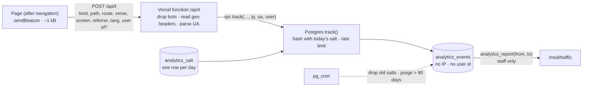

# Feature design: site analytics for moderators

Milestone M8 in the [README](../README.md#milestones). Status: phases A1 to A6 built 18 Sep 2026.

Moderators need to see how many people use the site and what they read: visitors, page views, unique views, which verses people tap, and where readers are and on what devices. This document fixes what is collected, how it stays private, where it lives, and the order it is built in.

## 1. Decisions

| Question | Decision |
|---|---|
| Build or buy | Build. The About page promises no third-party tracking scripts, reading habits on a Bible site are sensitive (religious belief is special-category data under GDPR, and India's DPDP Act 2023 requires consent for personal data), and moderators already have a role and a `/mod` area. Google Analytics would add a cookie banner, tens of kilobytes of script and a third party. |
| Who sees it | Reviewers and moderators, in `/mod/traffic`, enforced in Postgres (`is_staff()`), like the review queue. |
| Identity | No cookies, no stored IP address, no stored user id. A visitor is a daily-rotating hash; a signed-in user is a separate daily-rotating hash. Nobody can be followed from one day to the next, and no moderator can see what a named person read. |
| "Users" | Counted, not identified: visitors per day, and signed-in users per day, each from its own hash. |
| Country, region, city | From Vercel's edge geolocation headers (`x-vercel-ip-country`, `x-vercel-ip-country-region`, `x-vercel-ip-city`) on the collection request. The IP address is hashed with the day's salt inside Postgres and never written. |
| Device and resolution | Device class, OS and browser from the user-agent on the server; screen resolution (CSS pixels) from the page. |
| Verse clicks | One event when a reader selects a verse (taps its number), with the verse id. |
| Opt-out | Browsers that send Global Privacy Control or Do Not Track are not counted at all. |
| Bots | Dropped on the server by user-agent (crawlers, previews, headless browsers, Lighthouse). |
| Retention | Raw events 90 days; daily rollups kept two years (phase A3). A day's salt is deleted the day after, so its hashes become unlinkable. |

## 2. Data flow

*The IP address and user id travel to one database function and stop there: it stores only hashes salted with a value that is deleted the next day.*

## 3. What is stored

`analytics_events`, one row per event:

| Column | Meaning |
|---|---|
| `at`, `day` | Time; the day in India time (Asia/Kolkata), which is also the salt's day |
| `kind` | `view` or `verse` |
| `path`, `route` | URL path without query; SvelteKit route id, so "all chapter pages" can be grouped |
| `verse` | For `verse` events: `JHN.3.16` |
| `book`, `chapter` | For chapter-page views: `JHN`, `3` |
| `visitor` | First 16 hex of sha256(salt ‖ ip ‖ user-agent) |
| `member` | First 16 hex of sha256(salt ‖ user id) for signed-in readers, else null |
| `country`, `region`, `city` | From the edge headers |
| `device`, `os`, `browser` | `mobile` / `tablet` / `desktop`; family names only, no versions |
| `screen` | `390x844` (CSS pixels) |
| `referrer` | The referring site's host only, and only when it is another site |
| `lang` | Interface language, `ta` or `en` |

Nothing in the table identifies a person. `analytics_salt(day, salt)` holds one random salt per day; the collector reads today's, and a daily job deletes older ones.

## 4. What moderators see

`/mod/traffic`, a tab beside the queue:

- a range of 7, 30 or 90 days, or a year;
- a live panel: visitors, views and verse clicks in the last 30 minutes, the pages being read and where from, refreshed every minute;
- tiles: page views, visitors, unique page views, signed-in users, verse clicks, each with its change against the previous period of the same length;
- a daily chart of one chosen measure, with a note on any day above three times the typical day;
- a grid of the 66 books shaded by chapter-page views;
- tables with bars and CSV export: top pages, parts of the site, most-read chapters, most-tapped verses, verse clicks by book, search terms, searches with no result, countries, cities, devices, screen resolutions, operating systems, browsers, referring sites, interface language.

Definitions, shown on the page:

- **Visitors** are counted per day and summed over the range, because the daily salt makes the same person on two days two visitors. This over-counts returning readers; it is the price of not tracking them.
- **Unique page views** count each visitor once per page per day.
- **Signed-in users** are counted the same way as visitors, from the member hash.

## 5. Abuse and limits

- The collector is public, as any analytics endpoint must be. `track()` caps each visitor at 600 events a day and rejects malformed input; a determined forger can still add noise, which is accepted.
- Each page view costs one Vercel function call and one insert. At tens of thousands of views a day that is well inside the free tiers; phase A3's rollups keep the table small.
- The page's share is one small module (~1 kB) loaded with the layout, inside the site JavaScript budget. The `/mod` pages have their own 60 kB budget in `scripts/size-check.mjs`, so staff-only code never counts against readers.

## 6. Roadmap

| Phase | What | Status |
|---|---|---|
| **A1 · Collect** | Migration (`analytics_salt`, `analytics_events`, `track()`, retention jobs); `/api/t` with bot filter, geo headers and user-agent parsing; page-view and verse-click beacons; GPC/DNT opt-out; About page privacy text updated | Built 18 Sep 2026 |
| **A2 · Dashboard** | `analytics_report(from, to)` (staff only); `/mod/traffic` with range switch, tiles, daily chart and ranked tables; pgTAP tests for who can read and write | Built 18 Sep 2026 |
| **A3 · Rollups and retention** | `analytics_daily` and `analytics_daily_totals` filled nightly at 06:00 India time by `analytics_rollup_pending()`; the report reads rollups for finished days and live counts for the rest, so a year's range stays fast; raw events purged after 90 days, rollups after two years | Built 18 Sep 2026 |
| **A4 · Reading insight** | Book and chapter recorded with each chapter-page view; books grid, most-read chapters, verse clicks by book, parts of the site (reading, atlas, dictionary, places, people, search…), search terms and searches with no result from `search_log` | Built 18 Sep 2026 |
| **A5 · Live and export** | `analytics_now()` live panel; CSV export of the daily series and every table; change against the previous period on each tile | Built 18 Sep 2026 |
| **A6 · Hardening** | Per-address limit of 60 events a minute in the collector (plus 600 a visitor a day in Postgres), 2 kB body cap, prefetches skipped, wider bot list, spike note on the chart, `scripts/analytics-load.mjs` dry-run load test (about 1,800 requests a second locally) | Built 18 Sep 2026 |
| **Next** | Countries on a map; per-page drill-down; alert moderators on the queue page when a day spikes | Ideas |

## 7. Owner items

None for A1 and A2: collection uses the existing public key and Vercel's own headers. A3's nightly job runs in Postgres with pg_cron, which the project already uses.
