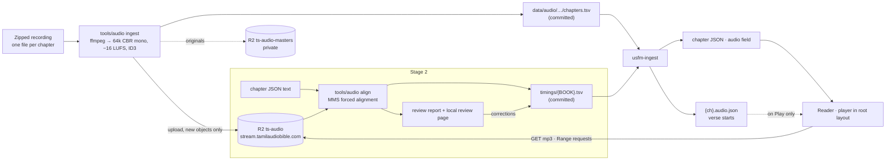

# Feature design: audio Bible

Status: design 24 Sep 2026, not built.

A reader who opens a chapter in a version that has a recording can listen to it. A player docked at the foot of the page plays, pauses, skips back and forward, moves to the previous or next chapter, and carries on into the next chapter by itself. The recordings are one MP3 per chapter, kept in Cloudflare R2 and served from Cloudflare's edge, never from Vercel.

The work comes in two stages:

- **Stage 1: whole chapters.** Playback always starts at the beginning of the chapter.
- **Stage 2: verse by verse.** An offline tool aligns each recording with the text and records when every verse starts. The reader can then choose "play from here" on any verse, and the verse being read is marked on the page as it plays.

## 1. Decisions

| Question | Decision |
|---|---|
| Where the MP3s live | A public R2 bucket, `ts-audio`, served on a custom domain, `stream.tamilaudiobible.com`, so Cloudflare's CDN caches it. R2 charges nothing for egress, and Vercel bandwidth is untouched. The original recordings go in a second, private bucket, `ts-audio-masters`, because a custom domain makes an entire bucket public. |
| Why a separate domain | An R2 custom domain needs its zone's DNS on Cloudflare. `tamilscripture.com` stays on Vercel DNS and hosting, so the site never depends on Cloudflare: an outage there affects only audio. `tamilaudiobible.com` is a Cloudflare zone in which only `stream.` is used now, to serve R2. The apex and `www` are kept for a simple audio site of their own, built later and outside this design; they don't redirect to `tamilscripture.com`. |
| Audio base address | One setting, `base` in `data/audio/audio.toml`, which `usfm-ingest` joins with each object key when it writes chapter JSON. Moving the audio to another domain or provider is a change to that line, a rebuild and a copy of the bucket. |
| Object keys | `{VERSION}/{recording}/{BOOK}/{BOOK}_{ccc}.mp3`, for example `IRVTAM/r1/JHN/JHN_003.mp3`. `recording` names one narration and one encode of it. A re-encode or a different narrator gets a new `recording`, so an existing URL never changes what it serves and every object is sent as `Cache-Control: public, max-age=31536000, immutable`, the same rule as the content build. |
| Audio format | MP3, mono, **64 kbit/s CBR**, 44.1 kHz, loudness normalised to −16 LUFS with a −3 dBTP true-peak ceiling (the sources are mastered hot, and a 64 kbit/s encode adds about 2 dB of overshoot, so −1.5 clipped), with an Xing header and ID3 tags (title, version, book, chapter) but no cover art. A constant bit rate makes `currentTime = t` land on the same sample in every browser. Seeks in a VBR file are estimated, and Firefox and Safari can drift by seconds, which stage 2 cannot tolerate. At 64 kbit/s a minute is about 480 kB and the whole Bible, roughly 80 hours, about 2.3 GB per version. |
| What the site knows about audio | Each recording has committed settings and a per-chapter manifest under `data/audio/{VERSION}/{recording}/`: `recording.toml` holds the narrator, licence and reading habits, and `chapters.tsv` holds book, chapter, duration in ms, bytes and sha256. `version.toml` only names the live recording (`[audio] recording = "r1"`). `usfm-ingest` adds a small `audio` field (src, duration) to each chapter's JSON that has a recording. A chapter with no recording has no field and shows no Listen button. The build id hashes these files alongside the Bible sources. The tool that produces them is designed in [feature_audio_tool.md](feature_audio_tool.md). |
| Why not a database lookup | A recording belongs to the text, not to a person, like everything else under `content/` (design §1, "scripture is static; people are dynamic"). Static files mean playback never waits on Postgres, keeps working offline, and every change is in git. Decided with the owner on 25 Sep 2026, after comparing the two approaches. |
| Where verse timings live (stage 2) | Committed TSV files, `data/audio/{VERSION}/{recording}/timings/{BOOK}.tsv`, about 600 kB of text per version. The build writes each chapter's verse starts to a separate static file, `{BOOK}/{ch}.audio.json`, beside the chapter JSON. The reader fetches it only on Play or "Play from here", so page loads carry no timings. If an in-site correction screen is wanted later, the ADR-13 pattern applies: the database holds the review workspace and an export writes accepted corrections back to the TSV. |
| Player placement | One `<audio>` element and its controls live in the root layout, not the chapter page. Client-side navigation (design §4) therefore never interrupts playback. Reading another chapter while listening is allowed, and "Back to the chapter being read" is one tap away. |
| Which version plays | The version the reader is on. In the dual view it is the left (primary) version, and the button says which one. Where the current version has no recording but another version in the same language does, the reader is offered that one ("Listen in TCV"). |
| Loading | `preload="none"`. Nothing is downloaded until Play, and the player's code is a chunk loaded on the first tap, so the reader route pays only for the button. |
| Offline | The service worker does **not** cache MP3s. They are large and fetched in byte ranges, and the 20-chapter content cache is sized for text. Saving a book's audio for offline use is a later phase. |
| Lock screen and headphones | Media Session API: title "யோவான் 3 · IRV", artwork from the site icon, handlers for play, pause, seek back and forward, previous and next track (previous and next chapter), and seekto. |
| Licensing | Each recording's licence and attribution are shown in the player's info sheet and on `/about`, exactly as for texts. **No recording is uploaded until its licence permits rehosting** (see §9). |

## 2. Data

### `version.toml`

```toml
[audio]
recording = "r1"   # the live recording; its settings are in data/audio/IRVTAM/r1/recording.toml
```

### Chapter JSON, new optional field (stage 1)

```json
"audio": { "src": "https://stream.tamilaudiobible.com/IRVTAM/r1/JHN/JHN_003.mp3", "ms": 312480 }
```

This is about 100 bytes.

### `{BOOK}/{ch}.audio.json` (stage 2)

The verse starts as `[verse, ms]` pairs, in order. A bridge (`\v 17-18`) has one entry under its first verse, and the reader resolves the other verses through the existing `bridges` map. A chapter whose alignment failed its checks has no file, and "Play from here" falls back to the chapter start.

```json
{ "verses": [[1, 3940], [2, 15880], [3, 27410], …] }
```

### Committed files

`recording.toml`, `chapters.tsv` and `timings/{BOOK}.tsv`, specified in [feature_audio_tool.md §3](feature_audio_tool.md#3-files). Only verse starts reach the site. The scores and flags stay in the repository for review.

## 3. Data flow



The upload is an owner step run on the owner's machine with an R2 API token. CI never uploads audio. CI only builds the committed manifests into content, so a deploy cannot publish a recording by accident, and a missing object shows up in the post-upload check rather than in production.

## 4. Stage 1: the tool and the player

### `tools/audio` (Python, run offline)

The full design, covering commands, file formats, encoding, alignment, the review page, upload and build integration, is in [feature_audio_tool.md](feature_audio_tool.md). In short, stage 1 needs `ingest` (unzip, map files to chapters, encode, write `chapters.tsv`), `upload` (new keys only, never overwritten) and `verify` (every chapter checked through the public domain).

Bucket CORS allows `GET` and `HEAD` from the site's origins, with `Range` allowed and `Content-Range`, `Content-Length` and `Accept-Ranges` exposed. A plain `<audio>` element doesn't need CORS, but the stage 2 review page and any future offline download do.

### Player (`src/lib/audio/`, design 12B desktop and 12A phone)

Built 25 Sep 2026 from Claude Design turn 12B ("Audio in the main reader"), with the 12A phone frame for narrow screens. The reader looks exactly as before until someone asks for audio.

- **கேள் · Listen** in the reader toolbar, beside text size (`ChapterPage.svelte`). It appears only when the chapter JSON has `audio`. While that chapter plays it becomes **கேட்கிறது · Listening**, with a gold border, the selected-verse fill and three moving bars that freeze while paused, and a tap pauses or resumes. On phones the same control is a ▶ in the header bar (`+layout.svelte`, 12A).
- **One player for the site** (`player.svelte.ts`): a single `Audio` element outside the page, so playback survives navigation and iOS keeps background audio across chapter changes. Playback always starts at verse 1 (12B), so there is no resume prompt.
- **The bar** (`PlayerBar.svelte`), its own 2.4 kB chunk, loaded on first play:
  - Desktop (12B): docked under the reading column, between the book rail and the context panel. From left: ⏮ previous chapter, ⟲ 10 s, the 40px gold ❚❚, 10 s ⟳, ⏭ next chapter, the reference, a 4px progress track that is also the seek control, the position, speed and ✕. 12B draws only ❚❚, reference, track, position, speed and ✕; the skip and chapter buttons were added because the owner asked for rewind, forward and track controls.
  - Phones (12A): it takes the thumb bar's place. A 3px line along the top, then ⟲, the 52px ❚❚, ⟳, the reference over the position, speed and ✕. Previous and next chapter are left to the lock screen and continuous play, for lack of width.
  - The position is "n / N" verses on a timed recording, else "2:35 / 5:12".
  - Speed cycles 0.75×, 1×, 1.25×, 1.5×, 2× and is remembered per device.
  - When the reader is on another page, the reference becomes a link back to the chapter being read.
  - Everywhere else on the site the bar runs across the foot of the window. `--player-h` is set in CSS while the bar is on the page (`html:has(section.player)`), so the verse action pill, the text-size card, the floating AA and the footer clear it.
- **Continuous play**: at the end of a chapter the next one loads into the same element. The page follows only if it was showing the chapter that ended. A chapter without a recording stops playback with a notice in the bar.
- **Lock screen and headphones**: Media Session with title, version and artwork. Play, pause, ±10 s, seek, previous and next chapter.
- **Keys**: K play/pause, J back 10 s, L forward 10 s. None were used by the reader before.
- **Accessibility**: every control is labelled in the interface language. The track is an `input type=range` with `aria-valuetext`. The bar is a labelled `section`, and focus never moves into it on its own.
- **Not done**: the `audio_play` analytics event, because the analytics code was being changed in another commit, and credits in the bar. The version's recording credits are in `manifest.json` (`audio`) ready for `/about`.

## 5. Stage 2: aligning verses to audio

### Method: forced alignment, not transcription

The text is already known, so the tool doesn't need to recognise speech. It only needs to find where each known word falls in the audio. The model is **Meta's MMS forced aligner** (`torchaudio.pipelines.MMS_FA`), a CTC acoustic model trained on more than 1,100 languages, much of it read Bible audio, and including Tamil. Text is romanised with `uroman` first, so the same model serves Tamil and English. Two alternatives were considered and set aside:

- *aeneas* (eSpeak synthesis plus DTW) is older and noticeably less exact on Tamil.
- *Whisper transcription plus fuzzy matching* is weaker on Tamil and does unnecessary work.

A whole Bible takes roughly 5–10 hours on a laptop CPU, run overnight and resumable, or under an hour on a GPU.

In outline, for each chapter:

1. Build the transcript from the chapter JSON, normalised and romanised.
2. Put wildcards at both ends for the chapter announcement and any closing music.
3. Align in 30-second windows.
4. Place each verse start in the pause before its first word, never more than 300 ms early.
5. Score and check every verse, flagging failures.
6. Review flagged verses on a local page before committing.

The details are in [feature_audio_tool.md §5–6](feature_audio_tool.md#5-align).

### In the reader (built with A2; comes alive when a chapter's JSON says `timed`)

- **Verse chips** (12B): while a timed chapter plays, every verse number becomes a 22px ▶ n pill, and the verse being read shows ❚❚ n, filled gold. Tapping a chip plays from that verse; tapping ❚❚ pauses.
- **The reading wash**: the verse being read gets a 16% gold background, not a highlight colour. It is found by binary search over the chapter's `.audio.json` starts on every `timeupdate`. The page scrolls to keep it in view unless the reader has scrolled by hand in the last four seconds; reduced motion makes the scroll instant.
- **"▶ 3:16 முதல் / Play from 3:16"** is the first action in the verse action bar (12A) on a timed chapter.
- Not yet: `?listen` links, for example `/john/3/16?listen`, to open a chapter ready to play from a verse.
- Tested 25 Sep 2026 on BSB John 3 with made-up timings: chips, wash, play-from-verse, follow scroll, the phone action and continuous play all behaved as above.

## 6. Budgets

- Measured 25 Sep 2026 (`scripts/size-check.mjs`): the reader route is 97.1 kB of 120, including the player store. The bar is a 2.4 kB chunk loaded on first play. Site JavaScript came to 262.6 kB, so its budget was raised from 260 to 270 kB, as it was for the concordance and presentations.
- Chapter JSON: about 100 bytes in stage 1, and nothing more in stage 2, because verse starts are in a separate `.audio.json` fetched on Play. Measured on the current build, inlining them would have added 0.35 kB compressed to John 3 and 1.4 kB to Psalm 119.
- Network: nothing is downloaded until Play. A typical chapter is 1–3 MB, streamed progressively.

## 7. Cost (Cloudflare R2, list prices; check before signing up)

| Item | Estimate |
|---|---|
| Storage | 2.3 GB per version, so five versions is about 12 GB, plus masters. The first 10 GB are free, then $0.015 per GB-month: **under $1 a month** with masters included. |
| Egress | Free on R2. |
| Reads | Mostly served from Cloudflare's cache. Class B operations have 10 M free a month, then $0.36 per million. |
| Writes | About 1,200 per recording upload. Class A operations have 1 M free a month. |
| Vercel | No change: audio never passes through it. |

## 8. Roadmap

| Phase | What | Status |
|---|---|---|
| **A1 · Storage and tool** | Buckets, custom domain, CORS, cache rule (done 24 Sep 2026); tool steps T1–T4 (skeleton, ingest, upload and verify, build) | Storage done; T1–T4 built 25 Sep 2026; first upload pending |
| **A2 · Player** | கேள் button, docked bar (12B), phone bar (12A), controls, speed, Media Session, continuous play, keys; verse chips, wash and play-from-verse ready for timings | Built 25 Sep 2026; analytics event and /about credits to do |
| **A3 · Alignment tool** | Tool steps T5–T7 (align, review page, `.audio.json`); timings for the first version | T5 spike done 25 Sep 2026: 0.96–0.97 word scores on BSB and IRV, about 25 minutes a version on the owner's GPU |
| **A4 · Verse playback** | The UI is built with A2 and waits for T5–T7 timings; `?listen` links remain | Waiting on timings |
| **Later** | Save a book's audio for offline use; repeat a verse or passage (memorisation); a sleep timer; audio slides in presentations; synthesised narration for versions with no recording | Ideas |

A1 and A2 can ship with a single version as soon as one recording is cleared.

## 9. Risks and checks

| Risk | Check |
|---|---|
| **No rehostable Tamil recording** of IRV or TCV. Commercial ministry recordings usually allow streaming only through their own API, not copying. | The owner confirms the licence for each recording before `ingest` is run (§10). Fallback: a neural Tamil voice, licensed for publication, reading the CC BY-SA text. That output is also timestamped per verse by construction, so stage 2 comes free for it. |
| A recording follows a different edition or revision of the text | **It happened**: the "TCV" recording reads the IRV text, so TCV audio was removed (feature_audio_tool.md §14). Alignment against the wrong text scores about 0.6 against 0.96, and the T5 probe checks every same-language text before any timing is written. Stage 1 alone cannot tell, so no version turns audio on before its probe passes. |
| VBR or badly muxed sources make seeks drift | Everything is re-encoded to CBR with an Xing header, and `verify` checks headers. |
| A URL is reused for different audio | Keys are never overwritten (`upload` refuses to). A change means a new recording id. |
| An iOS background tab stops at the end of a chapter | One reused `<audio>` element. Tested on a physical iPhone as part of A2's exit test. |
| The narrator reads headings, or adds an intro or music | `reads_headings` and `intro` per recording, plus wildcard tokens at both ends. |
| Numbers, divine-name conventions or chapter notes read differently from the printed text | Low scores flag them, and the review page fixes them. The ±300 ms tolerance makes small errors invisible in use. |
| Cloudflare or the audio domain fails | Only audio stops: the player shows "audio unavailable" and the site, on Vercel DNS and hosting, is untouched. The `base` setting lets the audio move elsewhere with one config change. |
| The audio domain is used to spoof email | The domain sends no mail: a null MX record and `v=spf1 -all`. |
| A CSP added later blocks audio | None is set today. If one is added, `media-src` must include the audio origin. |

## 10. Owner items

1. **Recordings and licences**, per version: source, narrator, licence text and confirmation that it covers the same edition as the text. Candidates to check, none assumed: open recordings of the WEB, BSB and KJV (LibriVox KJV readings are public domain), and for IRV and TCV the text owners (Bridge Connectivity Solutions, Biblica) or the synthesised-voice fallback.
2. Domain: register `tamilaudiobible.com`, add it to Cloudflare (free plan), and point its nameservers there. If it's bought at another registrar rather than Cloudflare's, it stays free to move later.
3. On that zone: a null MX record and `v=spf1 -all` until the domain sends mail, plus a cache rule making `stream.` eligible for cache and honouring `Cache-Control`. The apex and `www` wait for the future audio site.
4. Cloudflare R2:
   - create `ts-audio` with the custom domain `stream.tamilaudiobible.com`, and `ts-audio-masters`, kept private
   - set CORS on `ts-audio` (§4)
   - create an R2 API token with write access to both, kept on the owner's machine only
5. Stage 2: a machine to run alignment, with ffmpeg and uv installed. A CPU is enough, at roughly 5–10 hours per version run overnight, or under an hour with an NVIDIA GPU.
