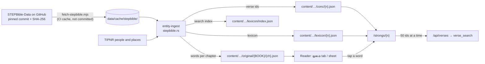

# Feature design: full Strong's concordance

Status: plan, 20 Sep 2026. Not started. Supersedes the names-only concordance (README 7.18), whose pages and links it keeps.

A reader who taps a Strong's number, or a Hebrew or Greek word, sees every verse that word occurs in, in the Tamil or English version they are reading. Today only proper names have Strong's numbers, from TIPNR. This plan adds every word of the Hebrew Old Testament and Greek New Testament, and says what loads when, so a phone on a slow connection never waits for the whole concordance.

## 1. Decisions

| Question | Decision |
|---|---|
| Source | STEPBible.org's word-tagged texts: TAHOT (Hebrew OT) and TAGNT (Greek NT), with the brief lexicons TBESH and TBESG for meanings. Same publisher and licence (CC BY 4.0) as TIPNR, which the site already uses. The extended ("disambiguated") Strong's numbers are the same scheme TIPNR uses, so today's `/strongs/H0085` and `/strongs/G3972G` pages continue with complete data. |
| Not used | TTESV (Tyndale tags for the ESV): CC BY-NC, and it tags the ESV, which we do not show. |
| Raw files in the repository | No. Every STEP file asks "Refer others to github.com/STEPBible as the source of the data. Please do not redistribute it yourself." The build downloads them from GitHub at a pinned commit, checks SHA-256 hashes, and publishes only derived data with credit. The same applies to TIPNR, which is committed today and should move to the same fetch (§11). |
| Granularity | Verse level. The tags say which verses contain a Hebrew or Greek word, not which Tamil word translates it; Tamil and the other versions are not word-aligned. The original word is shown beside each verse instead, and the reader can open a verse's Hebrew or Greek words. |
| Where it lives | Static files built by `entity-ingest` and served from the CDN like the rest of `content/`; verse text through the existing `/api/verses`. No database change. |
| STEP's grammar numbers | H9001 to H9049 are STEP's own numbers for prefixes, suffixes and punctuation (the "and" prefix, the definite article, the end-of-verse mark). They are in up to 23,184 verses each and are not Strong's words. They get no concordance page and are shown in the original-words view as grammar, not as links. |

## 2. Sources

| File | Size | What it gives |
|---|---|---|
| TAHOT, 4 files (Gen–Deu, Jos–Est, Job–Sng, Isa–Mal) | 70.2 MB | Every Hebrew word: reference and word number, Hebrew, transliteration, English gloss, Strong's number(s), morphology |
| TAGNT, 2 files (Mat–Jhn, Act–Rev) | 30.1 MB | Every Greek word, with the editions that contain it (NA28, TR, Byz …) |
| TBESH (Hebrew), TBESG (Greek) | 3.3 MB, 4.7 MB | Per Strong's number: lemma, transliteration, part of speech, short gloss, definition |

Repository `github.com/STEPBible/STEPBible-Data`; measured at commit `b99716b0cddb` (18 Sep 2026). Credit on every concordance page and on `/licences`: "STEPBible.org (Tyndale House, Cambridge), CC BY 4.0".

## 3. What the data holds

Measured from the six text files against our IRV text (20 Sep 2026):

| Measure | Value |
|---|---|
| Word tags | 682,563 |
| Distinct numbers | 17,039 (including STEP's grammar numbers) |
| Verse–number pairs | 525,799 |
| Verses per number, median | 2 |
| Numbers in more than 1,000 verses | 66; more than 5,000: 13, nearly all grammar numbers. The largest true word is the Greek article G3588, in 7,075 verses. |
| Verse ids for one number, delta-encoded and gzipped | largest 5.7 kB; all numbers together 1.5 MB |
| Original words per chapter, gzipped | median 7.3 kB, largest 22.7 kB (1,189 files, 9.1 MB) |
| Versification | STEP uses NRSV numbering. Against our 31,103 verses, the only differences are 116 Psalm titles numbered as verse 0, Revelation 12:18 (our 13:1), and 2 Corinthians 13:13–14 (one verse in NRSV, two in ours). §8. |

The consequence for loading: even the largest list of verse references is under 6 kB, so a page can always have the whole list at once. What cannot load at once is the verse text (7,075 verses for the article), so text is what streams.

## 4. Data flow

## 5. Build outputs

| File | One per | Holds | Size |
|---|---|---|---|
| `lexicon/{n}.json` | Strong's number (about 17,000; STEP's 49 grammar numbers excluded) | lemma, transliteration, part of speech, gloss, definition trimmed to 1,500 characters, occurrence count, per-book counts, related names from TIPNR | about 1 kB |
| `conc/{n}.json` | Strong's number | the verse ids in canonical order, delta-encoded integers (`book × 10⁶ + chapter × 10³ + verse`), and for each verse the surface form(s) of the word as an index into a small forms table | up to 6 kB gzipped |
| `original/{BOOK}/{ch}.json` | chapter (1,189) | every word of the chapter in order: verse, word number, Hebrew or Greek, transliteration, English gloss, Strong's number, morphology code | median 7.3 kB gzipped |
| `lexicon/index.json` | — | number, lemma, transliteration, gloss, count: for search, read on the server only | 1–2 MB, never sent to a browser |

About 35,000 new files and roughly 20 MB gzipped (verse lists 1.5 MB, original words 9.1 MB, lexicon entries the rest). Every file is immutable per build, like chapter JSON.

## 6. Progressive loading

What arrives, in order, when a reader taps a Strong's number:

| Step | When | What | Size | From |
|---|---|---|---|---|
| 1 | Page request | Page with the lexicon entry, the total, and the book strip with counts | HTML; the page's own code about 2 kB | ISR, cached until the next deploy |
| 2 | Right after paint | The whole verse id list | ≤ 6 kB | CDN, immutable, kept by the service worker |
| 3 | At once, then as the reader scrolls | Text of 50 verses at a time in the reader's version, next batch fetched when the last 10 rows come into view | about 5–8 kB per batch | `/api/verses`, cached a day at the edge |
| 4 | Tapping a book in the strip | That book's verses first, with text | as step 3 | as step 3 |

Rules that keep it light:

- **Ids first, text second.** The list is complete from step 2, so the book strip, counts and "jump to Romans" work before any text arrives. Rows show their reference immediately and fill in their text.
- **Only visible text.** An `IntersectionObserver` requests the next batch when the reader nears the end of the list; nothing loads for rows nobody scrolls to. Rows keep a fixed minimum height so arriving text does not move the page (CLS budget).
- **Very common words.** For a word in more than 1,000 verses (66 numbers), the page leads with the book strip and its counts, loads only the first book's verses, and lets the reader pick another book instead of scrolling through thousands of rows.
- **Changing version** reuses the id list and refetches only the visible text.
- **Offline.** The service worker keeps `conc/` and `original/` files cache-first like chapter JSON, so a word already looked up reopens without a network; text batches already fetched are cached like reader pages.

In the reader, the original words load only when asked for:

| Step | When | What | Size |
|---|---|---|---|
| 1 | Reader opens a chapter | nothing extra | 0 |
| 2 | First tap on மூலம் (Original) for a verse, or the Study Bible panel's tab | That chapter's `original/{BOOK}/{ch}.json` | median 7.3 kB |
| 3 | Tapping a word | Navigation to its concordance page (§6 above) | — |

## 7. Screens

- **Concordance page `/strongs/{n}`** (extends today's): header with lemma in Hebrew or Greek, transliteration, part of speech, gloss and definition; "used for" names from TIPNR where the word is a name; book strip with counts; verse list grouped by book, each row with reference, the verse in the reader's version, and the original form used in that verse (אֱלֹהִים, Θεοῦ …); filter to one book; share link keeps the book (`/strongs/H0430G?b=PSA`).
- **Reader, original words (மூலம்):** a new context-panel tab on wide screens and a sheet on phones, opened from the verse action bar. It lists the selected verse's words in order: Hebrew or Greek, transliteration, English gloss, Strong's number as a link, and morphology on hover. Grammar numbers appear without links.
- **Search:** `/dictionary` gains a "Strong's" filter, and the search box accepts `H430`, `G26`, a lemma, a transliteration or an English gloss ("love", "agape"). The search runs on the server over `lexicon/index.json`, as the dictionary browse does now.
- **Everywhere a Strong's number appears** (name cards, study panel, person pages) the link keeps working, now to the complete list.

## 8. Versification

STEP numbers verses as the NRSV does. The build maps three kinds of difference to our verse ids, and fails if any tagged verse has no home, so a new STEP release cannot silently drop verses:

| STEP (NRSV) | Ours | Rule |
|---|---|---|
| Psalm title, `PSA.n.0` (116 psalms) | the psalm's first verse, or its heading where our text has one | attach to `PSA.n.1` |
| `REV.12.18` | `REV.13.1` | one-verse shift |
| `2CO.13.13` (holds our 13:13–14) | `2CO.13.13` and `2CO.13.14` | list under both |

STEP's TVTMS file documents these traditions if more cases appear.

## 9. Budgets and limits

- Browser JavaScript: the concordance page stays about 2 kB; the original-words panel is a lazy chunk loaded on first use. The reader page budget (120 kB) is unchanged.
- `/api/verses` already caps a request at 60 verses and caches for a day at the edge; the page sends at most one request per 50 rows.
- Build: parsing 100 MB of text in Rust adds seconds; CI caches the downloads by commit hash. The determinism check covers the new files.
- Deploy size: roughly 20 MB gzipped more across about 35,000 files. Checked against Vercel's limits in phase C1 before anything else is built (§11).

## 10. Roadmap

| Phase | What | Done when |
|---|---|---|
| **C1 · Data** | `scripts/fetch-stepbible.mjs` (pinned commit, SHA-256); `stepbible.rs` in `entity-ingest` parsing TAHOT, TAGNT, TBESH, TBESG; versification mapping with a failing test for unmapped verses; outputs of §5; deploy-size check; TIPNR moved to the same fetch | Every one of our 31,103 verses has its words; `conc/H0430G.json` lists the verses of אֱלֹהִים; CI green, output deterministic |
| **C2 · Concordance page** | Lexicon header, book strip, whole id list, text streaming as you scroll, book filter, original form per verse, credit | Opening G3588 (7,075 verses) shows the first verses within a second on 4G and never downloads more than it shows |
| **C3 · Original words in the reader** | மூலம் tab and sheet for the selected verse, lazy chunk and chapter file, words link to the concordance | Selecting John 3:16 lists its Greek words; tapping ἠγάπησεν opens G0025 |
| **C4 · Search** | Strong's filter in `/dictionary`; number, lemma, transliteration and gloss search on the server; results in `/search` | "agape", "G26", "அன்பு" (after C5) each find G0026 |
| **C5 · Tamil glosses** | Tamil gloss per lexicon entry, drafted outside the repository and corrected through the existing review queue, like dictionary paragraphs | Glosses shown with the draft or reviewed badge |
| **Later** | Word-level highlighting in Tamil text needs a Tamil–Hebrew/Greek word alignment, which no open dataset provides today | — |

## 11. Risks and checks

| Risk | Check |
|---|---|
| Deploy size or file count limits | C1 builds the output first and measures a preview deploy before any page work |
| Versification drift in a later STEP release | Build fails on any tagged verse without a home (§8); the commit is pinned |
| Redistribution request | Raw STEP files are fetched, never committed. TIPNR, committed at `data/entities/tipnr/TIPNR.txt` in this public repository, moves to the same fetch in C1; removing it from history would need a history rewrite and is the owner's call |
| Variant words in the Greek | TAGNT marks which editions contain each word; the concordance counts words in NA28 or TR, and the original-words view marks words absent from one of them |
| Very common words overwhelm a page | Pages for words in more than 1,000 verses open on the book strip (§6) |

## 12. Owner decisions

1. Approve STEPBible TAHOT, TAGNT, TBESH and TBESG as sources (CC BY 4.0, same publisher as TIPNR).
2. Whether to rewrite git history to remove the committed TIPNR file, or only stop tracking it from now on.
3. Tamil glosses (C5): who drafts them, as with the dictionary's Tamil drafts.
