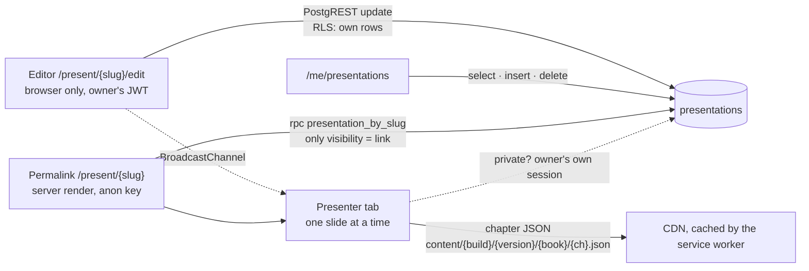

# Feature design: verse presentations

Status: P1–P3 built 21 Sep 2026 from design 11A (Claude Design handoff, "Tamil Bible Site Redesign", turn 11).

A preacher or Bible study leader makes a presentation of slides. Each slide holds one or more verses and optional notes written in Markdown. "Present" opens the slides in their own tab, full screen if wanted, driven from the keyboard. Every presentation has a permanent link that can be shared. Slides hold verse *references*, never verse text, so the translation can be changed later, by the author or by whoever opens the link.

## 1. Decisions

| Question | Decision |
|---|---|
| What a slide stores | Book, chapter and verse range, with an optional version per verse, plus Markdown notes and an optional title. The words are read from the site's chapter JSON when the slide is shown, in the presentation's default version or the one the viewer picks (`?v=tcv`). The database refuses any other key inside a slide, so text can never be stored by accident. |
| Where it lives | One row per presentation in Postgres, `presentations`, with the slides as one JSON document. A presentation is edited as a whole and is small (a few kilobytes), so one row saves and loads in one call and needs no ordering table. |
| Who may read | The owner, through the table under row-level security, like notes and highlights. Everyone else through one security-definer function, `presentation_by_slug()`, which returns the presentation only when it is shared by link and never returns the owner's id. A private presentation and a missing one look the same from outside. |
| The permalink | `/present/{slug}`, ten letters and digits drawn in the browser (no 0, o, 1, l or i, since links are read out loud). The slug is unique in the database; a slide number rides in the hash, `#3`. |
| Link previews | The permalink is server-rendered from the public function with the anon key, the same way `/api/verses` reads `verse_search`, so a shared link carries its title. Nothing else on the site reads user data on the server (ADR-9); this reads no session. The response is never cached. |
| Markdown | A small renderer in the app (`src/lib/md`, about 2 kB) that builds a tree and renders elements: no HTML string is ever produced from user text, so nothing needs sanitising. Headings, bold, italics, code, quotes, bullet and numbered lists, links (http, https, site-relative) and rules. Verse references in the notes become links with the site's hover preview, as everywhere else. |
| Editing while presenting | The editor broadcasts every change to a presenter tab in the same browser (`BroadcastChannel`), and the presenter reports the slide it is on. Other devices see changes on their next load. |
| Screen colours | The presenter is always night slate (design 11A), whatever the site theme: it is meant for a projector. The editor follows the site theme. |
| Who sees the list | `/me/presentations`, a tab of the personal pages, browser-rendered like the rest of `/me`. |

## 2. Data

`presentations`, one row each (migration `20260921120000_presentations.sql`):

| Column | Meaning |
|---|---|
| `id`, `user_id` | Owner, cascades on account deletion |
| `slug` | The permalink, `^[a-z0-9]{8,16}$`, unique |
| `title`, `subtitle` | Shown in the editor rail, the presenter's corner and link previews; 200 characters each |
| `version` | Default version code for the verses, `IRVTAM` |
| `visibility` | `link` (anyone with the link) or `private` (only the owner) |
| `slides` | JSON array, checked by `check_slides()` |
| `created_at`, `updated_at` | |

A slide:

```json
{ "id": "k4m2p7qx", "title": "அன்பின் அளவு",
  "verses": [ { "book": "JHN", "chapter": 3, "start": 16, "end": 16 },
              { "book": "ROM", "chapter": 5, "start": 6, "end": 8, "version": "TCV" } ],
  "notes": "## அன்பின் அளவு\n- **இவ்வளவாய்** — the measure of love\n> Illustration: the prodigal son" }
```

Limits, enforced in `check_slides()` and mirrored in `LIMITS` (`src/lib/present/types.ts`): 200 slides, 20 verses a slide, 20,000 characters of notes, 200 of title, 400 kB for the whole document. Book codes are USFM (`^[1-3A-Z]{3}$`), chapters 1–150, verses 1–176, `end ≥ start`.

The user's data export (`export_my_data()`) now includes presentations.

## 3. Data flow



## 4. Screens

- **Editor** (`/present/{slug}/edit`, design 11A "Presentation editor"): three columns under the site header. Left: title, subtitle, "saved just now", the slides as small cards (drag or Alt+↑/↓ to reorder), "new slide". Centre: slide n of N, default version, duplicate, delete, share (link, copy, anyone-with-link or only-me), Present (new tab); a 16:9 preview drawn by the same component as the presenter; the slide's title; notes with a formatting toolbar and Write / Split / Preview. Right: the verses on this slide, each with its version and a remove control; a box that takes a reference, a chapter (which lists its verses to pick from) or a word to search; the slide's cross-references, recently read verses and the author's highlights as one-tap additions. Saves 800 ms after the last change; warns before the tab closes with a save in flight.
- **Presenter** (`/present/{slug}`, design 11A "Presenter fullscreen"): the slide fills the window; a progress hairline at the top; a control pill at the bottom (previous, n / N, next, fullscreen, notes, version, ?) that fades after three seconds without the mouse; a shortcut hint bottom-left on opening; title bottom-right. Notes sit in a column on the right and drop below the verses on a portrait screen. A passage too long for the frame is shrunk until it fits. Taps on the right two thirds advance, on the left third go back; a swipe does the same.
- **List** (`/me/presentations`): every presentation with its slide count, version and date; new, edit, present, copy link, delete.

Keys in the presenter:

| Key | Action |
|---|---|
| Space, →, ↓, PageDown, Enter | next slide (Shift+Space back) |
| ←, ↑, PageUp, Backspace | previous slide |
| Home, End | first, last |
| F | full screen on or off |
| N | notes on or off |
| ? | the key list |
| Esc | leave full screen (the browser handles it), close the key list |

## 5. Budgets

The editor is one chunk (10.9 kB gzipped) fetched when its page opens, so the route node stays tiny; the presenter and the list are ordinary route nodes; the reference parser (wasm) loads on the first keystroke in the verse box, as in the header. Measured on 21 Sep 2026 (`pnpm size`): route nodes 104.7 → 110.7 kB of 120; site JavaScript 207.9 → 236.0 kB of 240, which leaves 4 kB, so the next feature of any size will need the budget raised as the concordance did. The reader route itself is unchanged.

## 6. Roadmap

| Phase | What | Status |
|---|---|---|
| **P1 · Data** | Migration, `check_slides()`, `presentation_by_slug()`, export; pgTAP `presentations.test.sql` | Built 21 Sep 2026 |
| **P2 · Editor** | List page, editor with rail, preview, notes, picker, autosave, share | Built 21 Sep 2026 |
| **P3 · Presenter** | Permalink page with server-rendered title, keys, fullscreen, auto-hide, version switch, follow-along channel | Built 21 Sep 2026 |
| **Later** | "Add to presentation" from the reader's verse action bar; a dual-version slide (Tamil beside English); a printed handout; duplicating a whole presentation; a presenter view with the next slide and a clock on the speaker's screen | Ideas |

## 7. Risks and checks

| Risk | Check |
|---|---|
| Notes are shown on a projector, so they must render without scripts or HTML | The renderer builds elements from a tree; `{@html}` is never used; links are limited to http, https, site paths, anchors and mailto |
| A shared link leaks the owner | `presentation_by_slug()` builds its own object without `user_id`; the pgTAP test asserts the key is absent and that anon cannot read the table |
| Verse text stored in a slide would go stale with a new Bible build | `check_slides()` allows only known keys, so `text` is refused on write (tested) |
| A long passage overflows the screen | `SlideView` shrinks the type until the column fits, on every size change and after fonts load |
| The service worker caches the presenter as a reader page | `/present/` is excluded from the reader-page cache |

## 8. Owner items

None: the migration applies on the next push through `deploy.yml`, and the feature uses the existing public key and sign-in.
